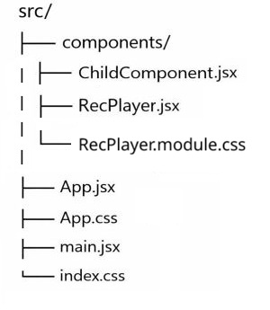

# Аудиозаписи `Океан Эльзы`

Небольшое учебное приложение на **React**, которое позволяет из созданного плейлиста выбрать аудиозапись и прослушать её .

---

## 🚀 Функциональность

- Отображение списка записей в плейлисте
- Выбор записи кликом
- Запуск выбранной записи
- Отображение аудиоплеера
- Воспроизведение и пауза по клику
- Очистка плейлиста
- Компонентный подход (App / RecPlayer / ChildComponent)
- Использование React Hooks (useState)

---

## 🛠 Используемые технологии

- React
- JavaScript (ES6+)
- CSS
- Vite / Create React App _(в зависимости от того, что ты используешь)_

---

## 📂 Структура проекта



---

## ▶️ Запуск проекта

1. Установить зависимости:

```bash
npm install
```

2. Запустить проект:

```bash
   npm run dev
```

3. Открыть в браузере:

```
   http://localhost:5173
```

(порт может отличаться)

## 🧠 Как это работает

- App хранит список аудиозаписей и управляет состоянием приложения

- RecPlayer:
  - формирует плейлист
  - запускает выбранные записи
  - очищает список выбранных записей
- ChildComponent обрабатывает ошибки, связанные с недоступными или несуществующими аудиоссылками

---

## 📌 Пример данных

```js
{
      id: "Обійми",
      url: "https://.../okean-elzi-obijjmi.mp3",
    }
```

---

## ✨ Возможные улучшения

- Добавить воспроизведение всех выбранных записей одним кликом

- Использовать TypeScript

- Добавить API с реальными данными

- Добавить тесты

- Реализовать адаптивную вёрстку

---

👩‍💻 Автор

Проект создан в учебных целях для изучения React.

---
